# MMC4W - Minimal MPD Client for Windows

This help file was updated for the v2.0.4 release.

## Putting the Music First

**MMC4W** is first and foremost **Minimal**.  That may be a little misleading, because it does quite a lot.  The GUI is minimal so as to quietly go about its business. This is about the music. That was the original point of this exercise.

**MMC4W** is a MPD Client.  To be clear, you must have access to a running [MPD](https://www.drgerg.com/mpd-is-just-awesome.html) server for this app to be of any value to you.

**MMC4W** is open source, and does not send any data out to anyone anywhere.  It connects only to the MPD server you specify in the configuration file. (mmc4w.ini)

The interface contains the basic required buttons to control a MPD server:

- Vol +, Vol -, Play, Stop, Prev, Pause, Next and Quit.
- A 'Mode' button eliminates the Windows title bar if desired.
- An 'Art' button toggles a very small window that displays embedded album art.  
    - If no embedded art is found, MMC4W's logo is displayed.

### The **'File'** menu contains these functions:

- Configure : Opens mmc4w.ini for editing. Uses Windows configured .ini editor. (Notepad or similar)
- Select Server : Allows you to select a server from the list in mmc4w.ini. Prompts you to select a playlist also.
- Toggle an Output : Allows you to enable and disable configured outputs on the MPD server.
- Toggle Logging : Toggles logging On or Off.  Restart the app after toggling.
- Reset Win Positions: Puts the two primary windows back where they were originally.
- Create New Saved Playlist : Creates a new empty playlist with your specified name
- Remove Saved Playlist : Permanently deletes a saved playlist. Permanently.
- Exit : Same as the 'Quit' button: exits the app.

### The **'Tools'** menu has these functions:

- Reload Current Title : Reloads data about the current playing song, including art.
- Turn Random On : Turns on random playback. Text area background is white.
- Turn Random Off : Turns on sequential playback. Text area background is navy blue.
- Toggle Repeat : If repeat is 0, play stops when MPD gets to the end of the queue.
- Toggle Consume : If consume is 1, each song is removed from the queue after playing.
- Toggle Single : If single is 1, each song is only played once, but left in the queue.
- Toggle Titlebar : Exposes the Windows titlebar. This allows repositioning of windows.
- Update Database : Asks MPD to update the database. If nothing is changed, nothing happens.
- Set Non-Standard Port : Tells you how to set up a non-standard port.

### The **'Look'** menu has these functions:

- Play a Single : Select a single title by title. (also emulates a little console. See Searching.)
- Play an Album : Select an album by album title. Turns on sequential playback.
- Find by Artist : Select a single title by artist. Also get info at the same time.
- Load Last Selected Playlist : Restore your settings to the last configured playlist.
- Show Songs in Last Playlist : View the list of songs in the last selected PL. Click to play.
- Select a Playlist : Select any playlist available on the connected server.
- Update "Everything" Playlist : Make sure all songs are in the "Everything" playlist.
- Toggle PL Build Mode : Sets PL Build Mode. Easily add or delete songs from saved playlists.
- Launch Browser Player : If a streaming HTTP output is enabled on the server, opens your browser there.

### The **'Queue'** menu has this function:

- Find and Play : Opens a window displaying the songs in the queue. See below for more detail.

### The 'Help' menu contains:

- Help : This document.
- About : Look here to find your installation path and version number.

## Some Things MMC4W Does NOT Do:

- Does not constantly poll the server. - **MMC4W** checks back with the server when the song is ending.
- Does not discover servers.  You need to know the IP address of any servers you wish to control.
- Does not edit tags, display lyrics, get art from the web, display artist info, wash dishes or vacuum floors.
- Does not tell you what saved playlist was loaded into the queue on a server you just joined. Nobody can do that.

## First Run Process

MMC4W ships with a blank .ini file.  The first time you run it, it will pop up a box like this:

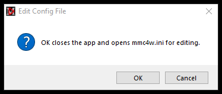

When you press the 'OK' button, **mmc4w** opens mmc4w.ini using the default Windows text editor.  On my system it's Notepad++.  Word processors like **Microsoft Word** should be avoided.  Only use a text editor that edits and saves plain ASCII text.  **Notepad** is perfectly fine for this job.

You need to type in your preferred MPD servers' IP address(es) in the [basic] section as shown.  Be sure to put that trailing comma on there whether you have one or several.

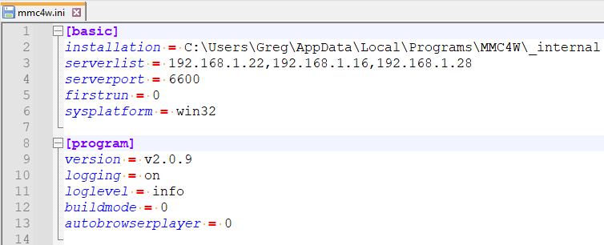

If you have more than one server, just string those IP addresses together as seen there.

After typing your server IP address(es) in the [basic] section, save and close the file.

Restart **MMC4W**.  When it starts, it will attempt to connect to the first server you provided.  You can change the server by using the option under the **'File'** menu.

In the text bar of the app you will see a prompt to select one of that server's playlists.

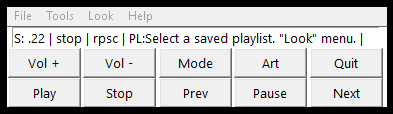

Click on the Look menu and select "Select a Playlist". Once you've clicked on a playlist, you can hit the **'Play'** button.  You may notice an entry following "Current Playlist - ".  You will still want to click on a list in the dropdown even if you choose the same one.

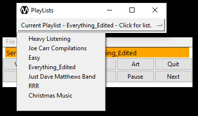

### Normal Operation

After you press **'Play'**, just kick back and enjoy the music.

MMC4W will show you these basic statistics, alternating between the two lines of text shown in these two images:

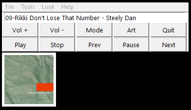 Track number, Track name and Artist.

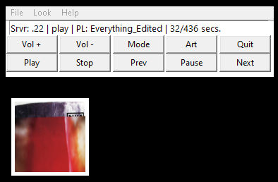 Server, Play Status, PlayList and Elapsed-vs-Duration in seconds.

Random, rePeat, Single and Consume status is shown here.  A capital letter means 'ON', lower case means 'OFF'. 'P' is for rePeat because you can't have two 'R's.

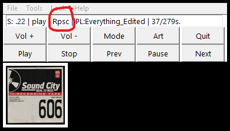

The **'Art'** button toggles the small album art window.

The **'Mode'** button toggles the titlebar like this:

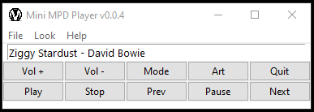

When the titlebars are on, you can drag the windows around. (You will likely have to expand the art window a bit).  Where you leave the upper-left corners gets saved when you press **'Mode'** again.  Your windows will stay there until you press **'Mode'** again.

The default out-of-the-box values are saved in the mmc4w.ini file at the bottom.  Use those in case things get out of hand.

### Search and Play inside the current queue

The **current queue** contains songs that were loaded from a saved playlist, or are the results of searches made from the database as described in the next section.

The **Queue** menu has a 'Search and Play' option.  If you select that option, it opens a window containing a sorted list of all the songs in the current queue.

You can jump to a specific song by entering a word that you expect to find in the title.  A list of songs in the queue containing that word are displayed.  Click the one you want.

You can also search using key:value pairs.  For example, to list songs by The Allman Brothers, type "artist:allman" without quotes.  You'll see a list of their songs.  To search by album name, type "album:greatest". That will return a list of all albums with 'greatest' in their name.

These searches are not case-sensitive.

Type **quit;** to close the window without making a selection.  The semicolon is required. 

### Search and Play directly from the music library

There are three options under the **'Look'** menu related to search.

- Play a Single
- Play an Album
- Find by Artist

 All three options use the same window, just differently. There's a 'mode' hint in the titlebar to help you out.

**Note:** The Search window is resizeable.  

 **Play a Single** opens the Search window and allows you to type some search term.  This is a **Title** search.  If any song title in the entire library contains the search term, it will be displayed when you press **[enter]**

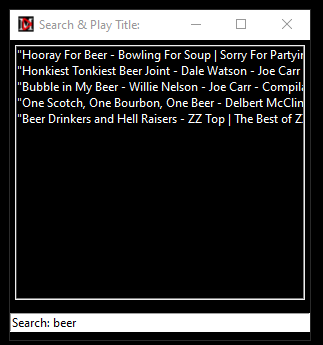 Song title search.

 When you click on one of them, it plays that one title then stops.  Use another **'Look'** menu option to do something else.

 **Play an Album** opens the same Search window.  This time you are searching for text contained in **Album** names.

 Clicking on a list entry loads up the songs on that album and plays them sequentially, first to last.  You will notice the text area turns blue with white text.  That is the visual indicator that **Random Mode** has been turned off.  

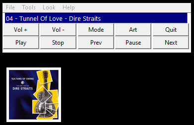 Album title search.

 I call this "**True Blue Album Mode**".  Use the **'Tools'** menu to turn Random playback on when you want it. No assumptions are made about whether you want random or sequential playback outside of Album Mode.

**Find by Artist** opens the Search window, but this time you are searching by Artist name.  Keep in mind this is the name as it appears in your music library. If you click in the Search: field and just press [enter], you'll get a list of all your songs ordered by Artist.  

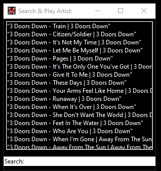 Artist search. Hit Enter for all songs.

This can be useful when you don't know what you're looking for.  Otherwise, type in some text to filter your list.

## Working with Saved Playlists

Saved playlists are the heart of **MMC4W**. To differentiate between **saved playlists** and the list of songs currently being played, the latter is called **"the queue"**.  **Playlists** are lists of songs saved to a file on disk with some meaningful name.

You load playlists into the queue and then MPD plays that queue using the settings in force at the moment.  

**MMC4W** will create a special playlist called "Everything" that contains all the songs in your library.  That option is found in the **'Look'** Menu.

### You can manipulate playlists in these ways:

 - Load a playlist into the queue.  **Look Menu** - Select a Playlist.
 - Reload the last playlist into the queue.  **Look Menu** - Reload Last Playlist.
 - List the songs in the last loaded playlist. **Look Menu** Show Songs in Last Playlist.
    - (moveable, resizable window)
 - Jump to and play a selected song from the last loaded playlist. **Look Menu** Show Songs in Last Playlist.
 - Create a new empty playlist. **File Menu** - Create New Saved Playlist.
 - Delete a playlist. **File Menu** - Remove Saved Playlist.
 - Add the currently playing song to any saved playlist.
 - Delete the currently playing song from the last loaded saved playlist.

## Adding and Removing Songs in a Saved Playlist:

**MMC4W** lets you add songs to playlists as you go.  No need to stop playback.

1) Use the **Toggle PL Build Mode** option in the **Look Menu** to turn on PL Build Mode.  &nbsp;&nbsp;&nbsp;&nbsp;Buttons turn red and green.  

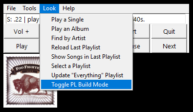

A window opens titled **"Playlists With and Without Current Song"**.  Playlists containing the current song are on the left, ones without the current song are on the right.  This window updates each time a new song starts.  

You can move and resize that window to suit your tastes.  When you exit PLBuild Mode, your settings are saved to the mmc4w.ini file.

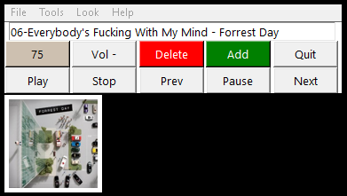

 2) If you're not already, play your music.  Playlists that do not contain this song are listed.  
 3) If you want to add the current song to a playlist, hit the green **Add** button.  A list of ALL playlists pops up.  
 4) Click on the playlist you want from the list. The current song will be added.  

**NOTE:** If you press **Quit** while in PLBuild Mode, **MMC4W** first turns PLBuild Mode off, then exits.

**That's it.**

#### Deleting a song from the current saved playlist is just as easy:

1) In **PL Build Mode**, when you hear a song you want to remove, click the red **'Delete'** button.  
2) Respond to the prompt, and if you selected OK, the song will be gone from the saved playlist.

**You can be intentional:**  
Use the **Play a Single**, **Play an Album**, or **Find By Artist** options under the **Look** menu to play a specific song or album.  
When it's playing, hit the green **Add** button and select the playlist.  

Use **Look** "Show Songs in Last Playlist".  Select the odious song you want to remove.  
Hit the **Delete** button to get rid of it. (or **Add** if you wish. I mean, you never know.)
## The 'mini console'

- Select the 'Play a Single' option.
- In the Search: field, type 'status' (no quotes).  You'll see the current status info.
- Type 'stats' and you'll get server stats appended to the bottom.  Scroll down.
- Type 'quit;' (with the semicolon) and the window closes.

This was something I just didn't want to do without.

## Playing with HTTP Outputs

**MPD** has the option of serving an audio stream over HTTP.  If the server is configured this way, you'll see the output listed by using the "File / Toggle an Output" option.

MMC4W offers basic support for MPD streams using HTTP. Note that is not HTTPS. That may make a difference.

In order to get the stream, you will have to know what **port** the server is using.  MMC4W comes with port 8000 set in the **mmc4w.ini** configuration file.  That is the default in the MPD server config file, but people often change it.  You'll have to put the correct httpd port in the **[serverstats]** section of the mmc4w.ini file.

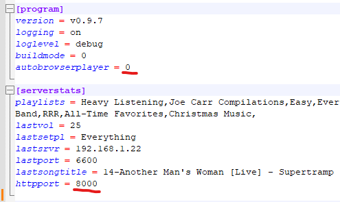

If an HTTP output is enabled, and music is playing, you can hear it through your default browser in Windows.  The **"Launch Browser Player"** option under the **'Look'** menu will start the playback if everything is on and running.  Simply close the browser or tab to stop it.  The server's playback is not affected. Other people listening to that stream will continue to hear it.

**Be aware**: this method of listening has its drawbacks.  You have to deal with buffering, network latency, lack of real controls, etc.  But under some circumstances, this may be an acceptable way to listen to your music.

**The "AutoBrowserPlayer"** setting might interest you if you regularly use the BrowserPlayer.  If you set this to 1 ('1' is ON), when you start MMC4W, *if there is an active stream* on the configured server, the browser will be called to play it.  Set the 'autobrowserplayer' to 0 to disable that behavior.

### NOTE - 

If you press **Stop**, the http stream stops. Browsers then close the connection, so if you restart playback, you'll need to refresh the browser window to regain the connection.  So will everyone else listening to that stream.  It's probably a good idea to avoid using the **Stop** button if there is more than one person listening to the http stream.

## Logging 

Logging can be enabled by using the '**Toggle Logging**' option under the **File** menu.

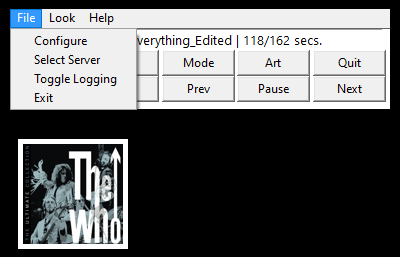

After using the '**Toggle Logging**' option, restart MMC4W.

MMC4W currently supports two levels of logging: **INFO** and **DEBUG**.  INFO lists basic actions that should be occurring as they occur.  DEBUG adds another layer of potentially useful data to the stream.

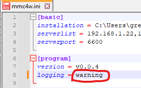

To set the logging level, use the '**Configure**' option and edit the **mmc4w.ini** file.  Type either 'info' or 'debug' where indicated (without quotes).

The resulting log file (**mmc4w.log**) can be found in the **_internal** folder in the installation folder.  The log file is deleted and started fresh each time you start **MMC4W**.  If you toggle Off logging, the last log file will remain until you delete it or create a new one by toggling logging On again.

The DEBUG file (**mmc4w_DEBUG.log**) does not start fresh with each run, and is not deleted. If you make the mistake of leaving MMC4W with debug logging turned on, that log file will continue to grow until you run out of disk space.  Don't be that guy. Turn debug logging off when you don't need it.

### Other Random Options

Under the **'Tools'** menu there is the **'Set Non-Standard Port'** option.  Choosing that opens a pop-up which provides details about how to set any port other than 6600 (the default MPD port).  Most people will never use this.

## Notes About What Happens Under the Hood

When you press '**Play**', MMC4W reaches out to the configured server and asks for data on the current song.  Then it asks for a status report.  From the returned data, MMC4W calculates how much longer the current song should be playing.  If album art is being displayed, it attempts to get art embedded in the song.  If no art is embedded in the song, it asks for folder art.  If that is successful, it displays the art.  If not, it displays the MMC4W logo.

MMC4W uses the Python **threading** module to run a timer in conjunction with a small set of global variables.  In this way we're able to keep the interface satisfactorily snappy and avoid having to poll the server every few seconds to determine if a new song is playing.

The Tkinter interface runs continuously waiting for button presses.  Blocking code (like sleep(10)) is avoided at all cost.  As a result, things work.  From my chair, it's perfect.  We'll see how long that perspective lasts, shan't we?

The design of this utility is intentionally simple.  I'm sure there are several 'better' ways it can be done, I just don't know what they are. 

### The mmc4w.ini File

Here is some explanation of the entries in the .ini file.  This config .ini file is pretty standard.  It is made up of key/value pairs.  "win_x = 412" is a key/value pair.  "win_x" is the key, "412" is the value.  We look up the values in this file by asking for the value associated with the key.  So, for example, I tell Python **myWinX = confparse.get('mainwindow','win_x')** and it tells me **myWinX** is now assigned the value of 412.

Items in red are filled in by the program.  You don't need to worry about those.  Other items that are not in red are things you can provide values for.  Green text following the key/value pair is intended to provide insights.

**NOTE:** The values in the 'position X or Y' items below are values that get added into calculations based on the display MMC4W is running on.  If you want to play with those, you should.  Just be aware the change you make might not have the result you expected.  **Not to worry:** just use the values in the **[default_values]** section to get back to where you started.

  [basic] You provide the list of servers on first run.  
  installation = C:\Users\Greg\mydrive\Projects\Python\Python in Windows\MMC4W  
  serverlist = 192.168.1.22,192.168.1.16,192.168.1.28,  
  serverport = 6600 You can change this if your server is not using the standard port.  
  firstrun = 0  
  
  [program] The options in this section are covered in this help file above.  
  version = v0.9.7  
  logging = on  
  loglevel = info  
  buildmode = 0  
  autobrowserplayer = 0  
  
  [serverstats]  
  playlists = Heavy Listening,Easy,Everything_Edited,Everything,RRR,Short Songs,All-Time Favorites,Christmas Music,  
  lastvol = 50  
  lastsetpl = All-Time Favorites  
  lastsrvr = 192.168.1.22  
  lastport = 6600  
  lastsongtitle = 08-When The Levee Breaks - Led Zeppelin  
  httpport = 8000 This is the port number your MPD server is serving http stream on.  You provide it if the default isn't accurate.  
  
  [mainwindow]  Things that affect the window with the buttons.  
  win_x = 412  
  win_y = 452  
  titlebarstatus = 0  
  
  [albumart]  
  aartwin_x = 412  The position of the top left corner of art on the X axis (horizontal).  
  aartwin_y = 350  The position of the top left corner of art on the Y axis (vertical).  
  albarttoggle = 1  
  artwinwd = 110  Width of the art window. You can change this and hit 'Next' to see it.  
  artwinht = 110  Height of the art window. You can change this and hit 'Next' to see it.  
  
  [searchwin]  
  swin_x = 220  The position of the top left corner of search windows on the X axis (horizonta).  
  swin_y = 600  The position of the top left corner of search windows on the Y axis (vertical).  
  swinht = 400  Height of search windows.  
  swinwd = 600  Width of search windows.  
  
  [default_values]  
  win_x = 412  
  win_y = 452  
  aartwin_x = 412  
  aartwin_y = 350  
  artwinwd = 110  
  artwinht = 110  

### Minutia

MMC4W was developed and tested in Windows 10.  **MPD** is running on three different computers here, one i7 Ubuntu, one i3 Ubuntu and one Raspberry Pi.  My music library is made up exclusively of FLAC files.  I rip my CD's (remember those?) using [Music Bee](https://getmusicbee.com/).  I create a 'folder.jpg' file for each album and embed the art in the songs using **[MP3TAG](https://www.mp3tag.de/en/)** or **Music Bee** depending on the circumstances.

I hope you enjoy using this as much as I do.  

  --------------------------------------------  
**MMC4W** is written in Python and complied using Pyinstaller.  The Windows installer is built using the Inno Setup Compiler.  
**Many thanks** to bauripalash (Palash Bauri) for [tkhtmlview](https://github.com/bauripalash/tkhtmlview), which makes this help file window look so good!  
**Also thanks** to [kaliko](https://gitlab.com/kaliko) for the [python-musicpd](https://gitlab.com/kaliko/python-musicpd) library!  
And of course none of this would be possible without the excellent contribution of [MPD](https://github.com/MusicPlayerDaemon) by Max Kellermann.  **Thanks!!**  
&copy;2023-2024 - Gregory A. Sanders (dr.gerg@drgerg.com)
