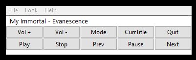

Here's a animated gif of the app doing its thing.
It may look bad here on github, but in real life, it looks like any other Tkinter-based program.  For my purposes, it's perfect.

If you want to see it as it is in real life, download the gif and play it locally.

